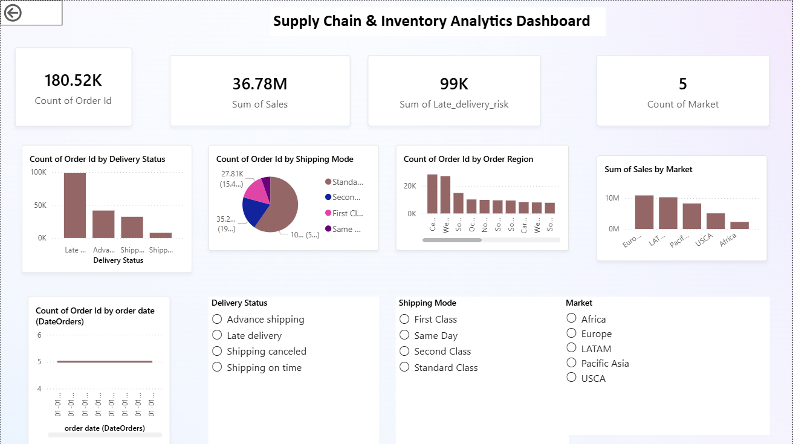

# Supply Chain Analysis

## Overview
Analyzed **180,519 supply chain orders** to identify delivery patterns, regional performance, and shipping trends. The goal was to understand where delays are happening, which markets are most active, and how orders are being shipped across different regions.

---

## Objectives
- Identify the most common delivery issues across all orders
- Analyze which markets and regions have the highest number of orders
- Understand which shipping modes are most frequently used
- Explore customer segments and their order volumes

---

## Tools Used
- **MySQL Workbench** — wrote SQL queries to count and group orders by delivery status, region, shipping mode, and market
- **Python (Pandas)** — loaded and cleaned the CSV data and explored the dataset
- **Power BI** — built an interactive dashboard with bar charts, pie charts, and slicers to filter data by region and shipping mode

---

## Dataset
- **Total Orders:** 180,519
- **Total Columns:** 53
- **Data includes:** Customer details, order information, delivery status, shipping mode, market region, sales, and profit

---

## SQL Queries Used

**Query 1: Total Number of Orders**
```sql
SELECT COUNT(*) AS total_orders 
FROM supply_chain_cleaned;
```
Objective: Find the total number of orders in the dataset.

---

**Query 2: Delivery Status Breakdown**
```sql
SELECT `Delivery Status`, COUNT(*) AS total
FROM supply_chain_cleaned
GROUP BY `Delivery Status`;
```
Objective: Count how many orders fall under each delivery status.

---

**Query 3: Top Order Regions**
```sql
SELECT `Order Region`, COUNT(*) AS total_orders
FROM supply_chain_cleaned
GROUP BY `Order Region`
ORDER BY total_orders DESC;
```
Objective: Identify which regions have the highest number of orders.

---

**Query 4: Shipping Mode Analysis**
```sql
SELECT `Shipping Mode`, COUNT(*) AS total
FROM supply_chain_cleaned
GROUP BY `Shipping Mode`
ORDER BY total DESC;
```
Objective: Find out which shipping mode is used most frequently.

---

**Query 5: Market Analysis**
```sql
SELECT `Market`, COUNT(*) AS total_orders
FROM supply_chain_cleaned
GROUP BY `Market`
ORDER BY total_orders DESC;
```
Objective: Identify the top performing markets by order volume.

---

## Key Findings

**Late delivery is the biggest problem** — 98,977 orders (54.8%) were delivered late, which is more than half of all orders. Only 32,196 orders shipped on time and 7,754 orders were canceled.

**LATAM is the top market** with 51,594 orders, followed by Europe with 50,252 orders and Pacific Asia with 41,260 orders.

**Standard Class is the most used shipping mode** — 107,752 orders (59.7%) used Standard Class. Same Day delivery was the least used with only 9,737 orders.

**Consumer segment is the largest customer group** with 93,504 orders, followed by Corporate customers (54,789) and Home Office (32,226).

**Central America is the top region** with 28,341 orders, followed by Western Europe with 27,109 orders.

**Total sales across all orders** was $36,784,735 with an average sale of $183 per customer.

---

## Dashboard Preview



---

## Findings and Conclusion

- **Delivery Performance:** Late delivery is the most critical issue, affecting 54.8% of all orders. This highlights a major gap in the supply chain that needs to be addressed.
- **Market Insights:** LATAM and Europe are the strongest markets, together accounting for more than half of all orders.
- **Shipping Preference:** Most customers prefer Standard Class shipping, suggesting cost is a bigger priority than speed for the majority of orders.
- **Customer Segments:** The Consumer segment drives the most orders, making it the most important group to focus on for improvements.

This analysis provides a clear picture of where the supply chain is performing well and where improvements are needed, especially in reducing late deliveries.

---

## Files
- `analysis.py` — Python script used to load, clean, and explore the dataset
- `supply_chain_cleaned.csv` — cleaned dataset with 180,519 rows and 53 columns
- `queries.SQL` — SQL queries written in MySQL Workbench
- `powerbi_dashboard.png` — screenshot of the Power BI dashboard
- `supply_chain.png` — bar chart showing delivery status distribution

---

## Author
**Sariya Khan** — Aspiring Data Analyst
GitHub: [Sariyaaa](https://github.com/Sariyaaa)
